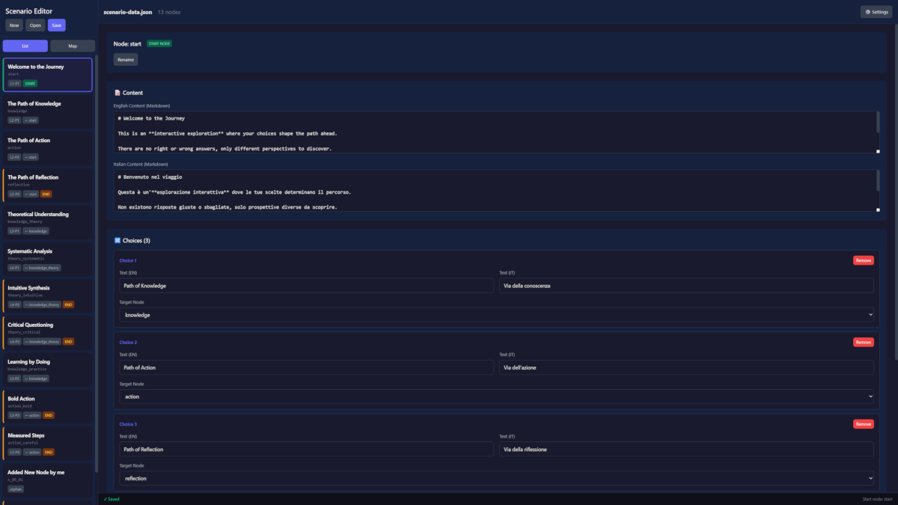
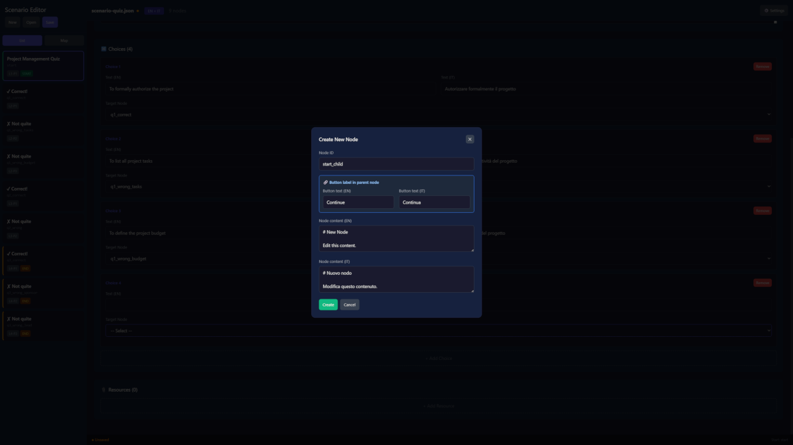

# Branching Navigator

An interactive branching narrative framework for creating decision-tree based experiences. Perfect for educational scenarios, corporate training, onboarding flows, and interactive storytelling.

## 📥 Download

**[Download ZIP](https://github.com/paolodalprato/interactive-simulators/releases/latest/download/branching-navigator-simulator.zip)** - Complete package with navigator, editor, and sample scenarios

## ✨ Features

- **Interactive Decision Trees**: Create multi-path narratives where user choices shape the journey
- **Visual Journey Map**: Real-time tree visualization showing visited paths and current position
- **Simple JSON Format**: Plain strings for all content, no complex structures
- **JSON-Based Content**: Easy-to-edit scenario files, no coding required for content changes
- **Visual Scenario Editor**: Dedicated tool for creating and managing scenarios
- **Visual Theme Editor**: Customize colors, branding, and fonts with live preview
- **Company Branding**: Add logo, company name, and website link
- **Google Fonts Support**: Choose from 9 font families including Inter, Roboto, Poppins
- **Resource Attachments**: Add downloads, links, and videos to any node
- **Progress Tracking**: Visual indicators for visited paths and current step
- **Backtracking**: Users can navigate back through their journey (via buttons; map jumps reset the path)
- **No Build Process**: Single HTML files, works directly in browsers
- **Fully Responsive**: Works on desktop and mobile devices

## 🎯 Use Cases

- **Corporate Training**: Onboarding flows, compliance training, process walkthroughs
- **Education**: Interactive lessons, decision-making exercises, case studies
- **Product Tours**: Feature exploration, user onboarding
- **Interactive Stories**: Choose-your-own-adventure narratives
- **Process Documentation**: Visual workflow exploration

## 📁 Project Structure

```
branching-navigator/
├── config.json                 # Configuration (scenario + theme files)
├── defaults.json               # Shared defaults (fonts, theme fallbacks)
├── branching-navigator.html    # Main navigator engine
├── scenario-editor.html        # Visual editor for creating scenarios
├── theme-editor.html           # Visual editor for customizing themes
├── theme.json                  # Theme configuration (colors, branding)
├── scenario-quiz.json          # Example: quiz with correct/wrong feedback
├── scenario-workflow.json      # Example: customer support escalation
├── scenario-sample.json        # Template: narrative with multiple paths
├── start-navigator.bat         # Quick start for navigator (Windows)
├── start-editor.bat            # Quick start for editor (Windows)
├── start-theme-editor.bat      # Quick start for theme editor (Windows)
├── README.md                   # This file
├── LICENSE                     # MIT License
└── docs/                       # Folder for downloadable resources
    └── (your PDF, DOC files)
```

## 🚀 Quick Start

### Option 1: Using Start Scripts (Windows)

- Double-click `start-navigator.bat` to run the navigator
- Double-click `start-editor.bat` to run the scenario editor
- Double-click `start-theme-editor.bat` to run the theme editor

### Option 2: Manual Start

1. Open a terminal in the project folder
2. Start a local server:
   ```bash
   python -m http.server 8000
   ```
3. Open in your browser:
   - Navigator: `http://localhost:8000/branching-navigator.html`
   - Editor: `http://localhost:8000/scenario-editor.html`

### Option 3: Deploy to Web Server

Upload all files to any web server or static hosting (GitHub Pages, Netlify, Vercel).

> ⚠️ **Important**: The navigator requires a web server due to JSON loading. It won't work by opening the HTML file directly (`file://` protocol).

## ⚙️ Configuration

The `config.json` file controls which scenario and theme to load:

```json
{
    "scenario": "scenario-sample.json",
    "theme": "theme.json",
    "showCredits": true
}
```

| Field | Description |
|-------|-------------|
| `scenario` | JSON file containing the scenario data |
| `theme` | JSON file containing theme/branding (optional, defaults to `theme.json`) |
| `showCredits` | Show author credits footer (optional, defaults to `true`) |

To switch scenarios or themes, change the values and refresh.

## 🎨 Using the Scenario Editor

The visual editor makes it easy to create and modify scenarios without editing JSON manually.

### Accessing the Editor

```
http://localhost:8000/scenario-editor.html
```

### Editor Features

- **Welcome Screen**: Start with a new scenario or open an existing file
- **Node List View**: See all nodes with their level and status (START, END, orphan)
- **Visual Map View**: Interactive tree visualization of your scenario
- **Inline Node Creation**: Create new nodes directly from the choice dropdown
- **Choice Text Validation**: The editor requires button text when creating nodes (prevents invisible choices)
- **Live Preview**: Test your scenario directly from the editor
- **Resource Management**: Add downloads, links, and videos to any node

### Workflow

1. Start the local server and open the editor
2. Click **New Scenario** or **Open File** to load an existing JSON
3. Click **Settings** to define scenario metadata (title, description, author)
4. Select a node from the sidebar to edit it
5. Add choices with **+ Add Choice**
6. Enter the **Button Text** first, then select a target node or use **+ Create new node...** to create a child node
7. Click **Save** to download the updated JSON
8. Copy the saved file to the project folder, replacing the old version
9. Hard refresh (Ctrl+Shift+R) the navigator to see changes

> 💡 **Tip**: When creating a new node, enter the button text first. The popup only asks for Node ID and content — the button text is already set.

### ⚠️ Important: Node Deletion

When deleting a node that has child nodes connected to it:

- The child nodes become **orphans** (disconnected from the tree)
- They remain visible in the editor but **invisible in the navigator**
- They appear in the Map view with a red border and "orphan" badge

**Best practice**: Delete nodes from the leaves (end nodes) upward, or manually reconnect orphaned nodes to other parent nodes before saving.

## 🎨 Using the Theme Editor

The theme editor allows you to customize the navigator's appearance with your company branding.

### Accessing the Theme Editor

```
http://localhost:8000/theme-editor.html
```

### Theme Editor Features

- **Live Preview**: See changes in real-time as you edit
- **Company Branding**: Add logo, company name, and website URL
- **Brand Positioning**: Place logo/name in any corner (top/bottom, left/center/right)
- **Color Customization**: Customize all colors (background, text, buttons, map nodes)
- **Font Selection**: Choose from 9 font families (System Default + 8 Google Fonts)
- **Import/Export**: Load and save theme files

### Available Fonts

| Key | Font |
|-----|------|
| `system` | System Default (no external load) |
| `inter` | Inter |
| `roboto` | Roboto |
| `open-sans` | Open Sans |
| `lato` | Lato |
| `montserrat` | Montserrat |
| `poppins` | Poppins |
| `source-sans` | Source Sans 3 |
| `nunito` | Nunito |

### Theme File Structure

```json
{
    "brand": {
        "name": "Your Company",
        "logo": "https://example.com/logo.png",
        "website": "https://example.com",
        "position": { "vertical": "top", "horizontal": "right" }
    },
    "typography": {
        "fontFamily": "inter"
    },
    "colors": {
        "background": "#ffffff",
        "text": "#1f2937",
        "accent": "#6366f1"
    },
    "buttons": {
        "choiceBackground": "#6366f1",
        "visitedBackground": "#10b981"
    },
    "map": {
        "nodeCurrent": "#6366f1",
        "nodeVisited": "#3730a3"
    }
}
```

All values are optional. Missing values use defaults from `defaults.json`.

### Multiple Themes

Create multiple theme files for different clients or contexts:

```
├── theme-corporate.json
├── theme-training.json
├── theme-dark.json
```

Switch between them by changing the `theme` value in `config.json`.

## 📝 JSON Structure

The scenario is defined in a simple JSON format with plain strings:

```json
{
    "meta": {
        "title": "Scenario Title",
        "description": "Description of the scenario",
        "author": "Author Name"
    },
    "translations": {
        "step": "Step",
        "restart": "Start Over",
        "endOfPath": "End of this path",
        "resources": "Resources",
        "viewMap": "View Map",
        "mapOf": "Map of",
        "back": "Back",
        "download": "Download",
        "openLink": "Open",
        "watchVideo": "Watch"
    },
    "startNode": "start",
    "nodes": {
        "start": {
            "content": "# Welcome\n\nThis is **markdown** content.",
            "choices": [
                { "text": "Option A", "next": "node_a" },
                { "text": "Option B", "next": "node_b" }
            ],
            "resources": []
        }
    }
}
```

> ⚠️ **Required**: The `translations` section is mandatory. Without it, navigation buttons will have no text.

### Supported Markdown

- `# Heading 1` and `## Heading 2`
- `**bold**` and `*italic*`
- `- list items`
- `> blockquotes`

### Resource Types

| Type | Description | Icon |
|------|-------------|------|
| `download` | Downloadable file (PDF, DOC, etc.) | 📥 |
| `link` | External URL (opens in new tab) | 🔗 |
| `video` | Video link | 🎬 |

## 🌐 Deployment

### GitHub Pages

1. Push your files to a GitHub repository
2. Go to Settings → Pages
3. Select "Deploy from a branch" and choose `main`
4. Your navigator will be available at `https://username.github.io/repo-name/branching-navigator.html`

### Multiple Instances

For multiple training modules, create separate folders with independent config files:

```
/training-portal/
├── onboarding/
│   ├── config.json
│   ├── branching-navigator.html
│   └── scenario-onboarding.json
├── compliance/
│   ├── config.json
│   ├── branching-navigator.html
│   └── scenario-compliance.json
```

### Embedding via iframe

```html
<iframe 
    src="https://your-domain.com/branching-navigator.html" 
    width="100%" 
    height="600" 
    frameborder="0">
</iframe>
```

## 📋 Technical Details

- **Framework**: React 18 (via CDN)
- **Styling**: Tailwind CSS + custom CSS
- **No build process**: Everything runs directly in the browser
- **Dependencies**: None (all loaded via CDN)

### Browser Compatibility

Chrome, Firefox, Safari, Edge (all modern versions)

## 🖼️ Screenshots

### Navigator Interface


### Journey Map


### Scenario Editor



### Create Node Popup



## 📄 License

MIT License - see [LICENSE](LICENSE) file for details.

## 👤 Author

**Paolo Dalprato**
- Website: [ai-know.pro](https://ai-know.pro)
- Substack: [paolodalprato.substack.com](https://paolodalprato.substack.com)
