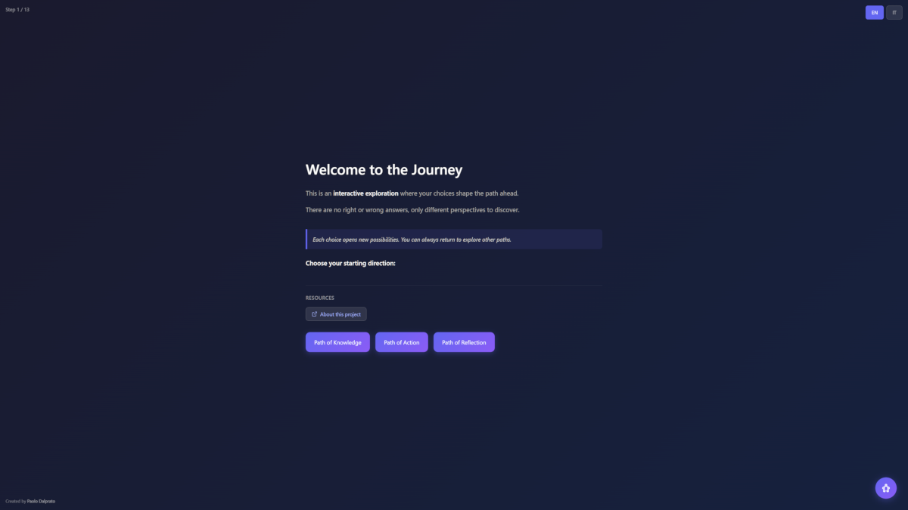
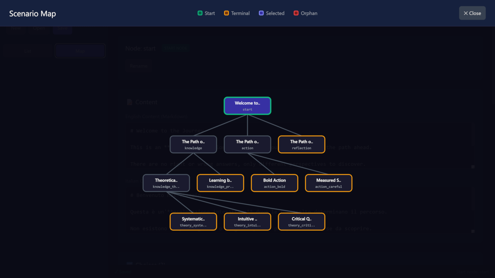
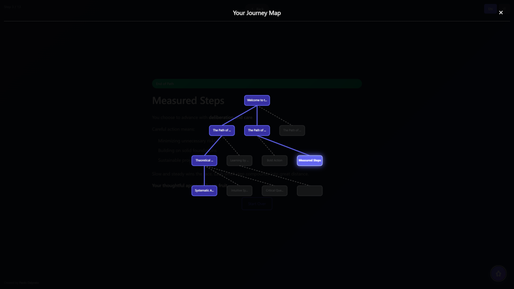
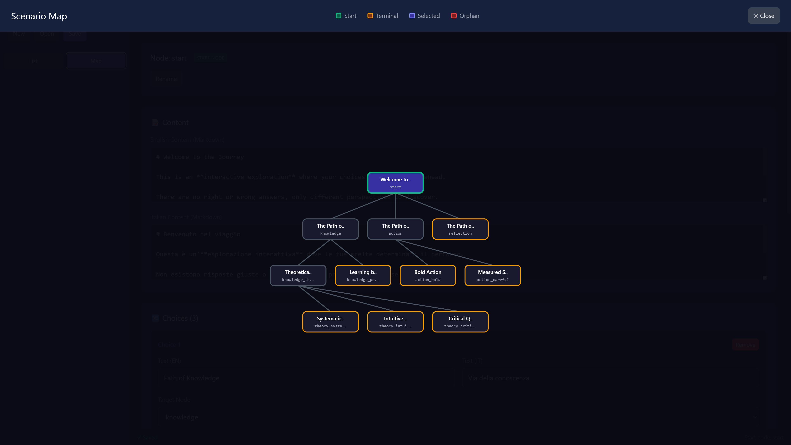
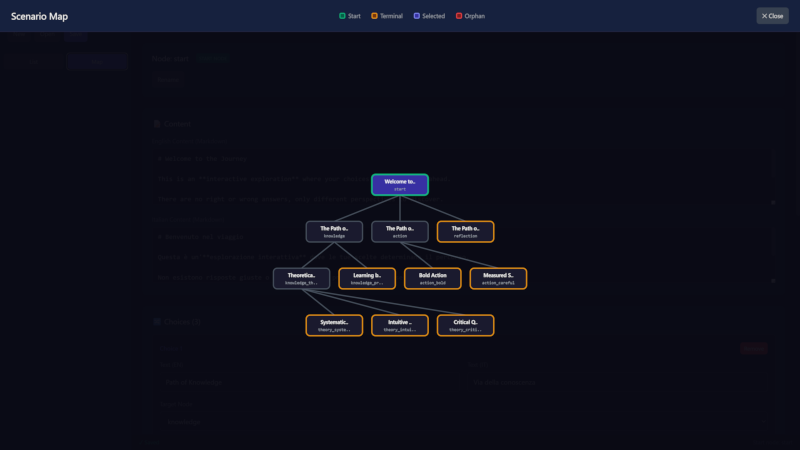

# Branching Navigator

An interactive branching narrative framework for creating decision-tree based experiences. Perfect for educational scenarios, corporate training, onboarding flows, and interactive storytelling.


*Screenshot placeholder: Navigator showing a decision point with multiple choices*

## ✨ Features

- **Interactive Decision Trees**: Create multi-path narratives where user choices shape the journey
- **Visual Journey Map**: Real-time tree visualization showing visited paths and current position
- **Bilingual Support**: Built-in English/Italian toggle (easily extensible to other languages)
- **JSON-Based Content**: Easy-to-edit scenario files, no coding required for content changes
- **Visual Scenario Editor**: Dedicated tool for creating and managing scenarios
- **Resource Attachments**: Add downloads, links, and videos to any node
- **Progress Tracking**: Visual indicators for visited paths and current step
- **Backtracking**: Users can navigate back through their journey
- **No Build Process**: Single HTML files, works directly in browsers
- **Fully Responsive**: Works on desktop and mobile devices

## 🎯 Use Cases

- **Corporate Training**: Onboarding flows, compliance training, process walkthroughs
- **Education**: Interactive lessons, decision-making exercises, case studies
- **Product Tours**: Feature exploration, user onboarding
- **Interactive Stories**: Choose-your-own-adventure narratives
- **Process Documentation**: Visual workflow exploration

## 📁 Project Structure

```
branching-navigator/
├── branching-navigator.html    # Main navigator engine
├── scenario-editor.html        # Visual editor for creating scenarios
├── scenario-data.json          # Example scenario (editable)
├── start-navigator.bat         # Quick start script (Windows)
├── README.md                   # This file
├── LICENSE                     # MIT License
├── docs/                       # Folder for downloadable resources
│   └── (your PDF, DOC files)
└── images/                     # Screenshots for documentation
    └── (screenshot files)
```

## 🚀 Quick Start

### Option 1: Using the Start Script (Windows)

1. Double-click `start-navigator.bat`
2. The browser opens automatically with the navigator
3. Press any key in the console to stop the server when done

### Option 2: Manual Start

1. Open a terminal in the project folder
2. Start a local server:
   ```bash
   # Python 3
   python -m http.server 8000
   
   # Node.js (if you have http-server installed)
   npx http-server -p 8000
   ```
3. Open `http://localhost:8000/branching-navigator.html` in your browser

### Option 3: Deploy to Web Server

Upload all files to any web server (Apache, Nginx, IIS) or static hosting (GitHub Pages, Netlify, Vercel).

> ⚠️ **Important**: The navigator requires a web server due to JSON loading. It won't work by opening the HTML file directly (`file://` protocol).

## 🎨 Using the Scenario Editor

The visual editor makes it easy to create and modify scenarios without editing JSON manually.


*Screenshot placeholder: Editor showing node list and editing panel*

### Accessing the Editor

```
http://localhost:8000/scenario-editor.html
```

### Editor Features

- **Node List View**: See all nodes with their level, parent, and status
- **Visual Map View**: Interactive tree visualization of your scenario
- **Create Nodes via Choices**: Add new nodes directly from the "Target Node" dropdown
- **Bilingual Content**: Edit English and Italian content side by side
- **Resource Management**: Add downloads, links, and videos to any node
- **Live Validation**: Orphan nodes are highlighted for easy identification

### Workflow

1. Click **Open** to load an existing `scenario-data.json`
2. Select a node from the sidebar to edit it
3. Add choices with **+ Add Choice**, selecting existing nodes or creating new ones
4. Use **+ Create new node...** in the Target dropdown to create child nodes
5. Click **Save** to download the updated JSON
6. Replace `scenario-data.json` with your saved file


*Screenshot placeholder: Full-screen map showing the decision tree structure*

## 📝 JSON Structure

The scenario is defined in a simple JSON format:

```json
{
    "meta": {
        "title": { "en": "Scenario Title", "it": "Titolo Scenario" },
        "description": { "en": "Description", "it": "Descrizione" },
        "author": "Author Name"
    },
    "startNode": "start",
    "nodes": {
        "start": {
            "content": {
                "en": "# Welcome\n\nThis is **markdown** content.",
                "it": "# Benvenuto\n\nQuesto è contenuto **markdown**."
            },
            "choices": [
                { "text": { "en": "Option A", "it": "Opzione A" }, "next": "node_a" },
                { "text": { "en": "Option B", "it": "Opzione B" }, "next": "node_b" }
            ],
            "resources": [
                { "type": "download", "label": { "en": "Guide", "it": "Guida" }, "url": "docs/guide.pdf" },
                { "type": "link", "label": { "en": "Website", "it": "Sito web" }, "url": "https://example.com" }
            ]
        }
    }
}
```

### Supported Markdown

- `# Heading 1` and `## Heading 2`
- `**bold**` and `*italic*`
- `- list items`
- `> blockquotes`

### Resource Types

| Type | Description | Icon |
|------|-------------|------|
| `download` | Downloadable file (PDF, DOC, etc.) | 📥 |
| `link` | External URL (opens in new tab) | 🔗 |
| `video` | Video link | 🎬 |

## 🌐 Deployment

### GitHub Pages

1. Push your files to a GitHub repository
2. Go to Settings → Pages
3. Select "Deploy from a branch" and choose `main`
4. Your navigator will be available at `https://username.github.io/repo-name/branching-navigator.html`

### Multiple Instances

For multiple training modules, create separate folders:

```
/training-portal/
├── onboarding/
│   ├── branching-navigator.html
│   ├── scenario-data.json
│   └── docs/
├── compliance/
│   ├── branching-navigator.html
│   ├── scenario-data.json
│   └── docs/
└── product-training/
    ├── branching-navigator.html
    ├── scenario-data.json
    └── docs/
```

Each instance is fully independent.

### Embedding via iframe

```html
<iframe 
    src="https://your-domain.com/branching-navigator.html" 
    width="100%" 
    height="600" 
    frameborder="0">
</iframe>
```

## 🔧 Customization

### Adding Languages

1. Add translations to the `translations` object in `branching-navigator.html`
2. Add a language toggle button
3. Include content in the new language in your JSON

### Styling

The navigator uses embedded CSS. Modify the `<style>` section to change:
- Colors and gradients
- Fonts and typography
- Button styles
- Layout and spacing

## 📋 Technical Details

- **Framework**: React 18 (via CDN)
- **Styling**: Tailwind CSS + custom CSS
- **No build process**: Everything runs directly in the browser
- **Dependencies**: None (all loaded via CDN)

### Browser Compatibility

- Chrome (recommended)
- Firefox
- Safari
- Edge

## 🤝 Contributing

Contributions are welcome! Feel free to:
- Report bugs
- Suggest features
- Submit pull requests

## 📄 License

MIT License - see [LICENSE](LICENSE) file for details.

## 👤 Author

**Paolo Dalprato**
- Website: [ai-know.pro](https://ai-know.pro)
- Substack: [paolodalprato.substack.com](https://paolodalprato.substack.com)

---

## 🖼️ Screenshots

### Navigator Interface


*Screenshot placeholder: Main navigator showing content, choices, and navigation elements*

### Journey Map


*Screenshot placeholder: Map overlay showing the complete decision tree*

### Scenario Editor


*Screenshot placeholder: Editor with node list and editing panel*

### Create Node Popup


*Screenshot placeholder: Popup for creating new nodes from choices*
